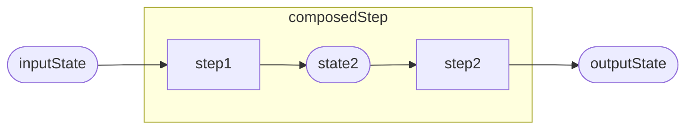

# Corvus.Pipelines

## What is it?

A low-allocation, extensible pipeline composition library, supporting sync and async functional pipeline steps arranged into terminating and non-terminating pipelines.

Out-of-the-box, it includes support for exception and error handling, logging, and cancellation.

Amongst other features, it supports (but does not require) ["railway oriented programming"](https://fsharpforfunandprofit.com/rop/) - avoiding exception throwing, and offering a functional approach to termination, error handling, and retries.

If you're familiar with these terms and know that's what you want, you can [review the ubiquitous language](./docs/ubiquitous-language.md) (so we can avoid miscommunication when using overloaded terminology), and  [skip ahead to the getting started section](#getting-started).

If you'd like to understand more about the thinking behind **Corvus.Pipelines** then read on.

## What can I do with it?

The library helps you to build programs dynamically (i.e. at runtime) out of predefined (functional) components, to operate on some particular state, and produce some result.

Those functional components are themselves stateless, and so can be reused without dynamic (re-)compilation/allocations etc.

It is useful when you want to be able to be able declaratively define the way in which a system responds to input, while dynamically adapting the processing to both the input state, and/or other environmental conditions.

It also supports moving (relatively) seamlessly from synchronous to asynchronous contexts, with minimal overhead, making it ideal for request processing and data scenarios where we frequently mix async processing (e.g. calling external services to augment our state) with synchronous processing (operating on our in-memory domain model).

It is particularly useful when you have a need for executing many, isolated pipelines that respond somewhat differently to different types of request, but share a lot of common processing.

## What kind of applications would find that useful?

It can be used in many applications, e.g. input handling, request processing, or data transformation.

Here are a few examples.

### ASP.NET Core
**Corvus.Pipelines** is particularly useful when coupled with, for example, [ASP.NET Core Minimal APIs](https://learn.microsoft.com/en-us/aspnet/core/fundamentals/minimal-apis/overview), or (especially) directly through `HttpContext`, to build lightweight pipelines for request processing from common building blocks.

We are using Corvus.Pipelines in code-generation scenarios for HTTP API handlers, where it is simpler to emit the code that builds pipelines than all of the code that they embody.

We also provide an `HttpContextPipeline` in `Corvus.Pipelines.AspNetCore` that directly supports `HttpContext` request processing.

### Corvus.YarpPipelines

We originally built this to help us reduce the complexity of building high-performance HTTP Request transforms in YARP proxies. We have also open-sourced our **Corvus.YarpPipelines** library which we have built on top of it.

### Corvus.Pipelines.Handlers

We use **Corvus.Pipelines** to implement a version of the [Chain of Responsibility](https://en.wikipedia.org/wiki/Chain-of-responsibility_pattern) pattern that doesn't couple each step directly to the next. We call this the Handler Pattern, and it is implemented by the types in the `Corvus.Pipelines.Handlers` namespace.

This is so useful, we include it in the **Corvus.Pipelines** library itself.

## Corvus.Pipelines vs. LINQ to objects vs. TPL Dataflow

### Q: But can't I do everything this does, and more, with assorted `Func<,>` and LINQ to objects?

### A: Yes; you can. But...

The idea of **Corvus.Pipelines** is to _constrain_ what you can do to make the programming model simpler, and enable some common patterns like retries, cancellation, logging and `Exception`-free error handling.

At the end of the day, it is just built on top of dotnet delegates/`Func<,>`, and you can bring in as much LINQ to objects as you like, around that! There's no special magic going on.

The workload that inspired the creation of this library started out just using LINQ-to-objects, but we rapidly discovered that we were having to write a lot of boiler plate around the code we really needed; and so this project was born.

### Q: What about TPL Dataflow - that has similar concepts in its blocks and networks, but gives us more control of parallelization and async behaviour.

### A: Yes, that's absolutely true.

[TPL Dataflow](https://learn.microsoft.com/en-us/dotnet/standard/parallel-programming/dataflow-task-parallel-library) is a very powerful library with a similar philosophy of in-process state-passing for dataflow and pipelining tasks.

It gives you much more control over the async context than we offer in **Corvus.Pipelines**.

However, it is much more heavy-weight; it doesn't attempt to minimize allocations, or optimize for (largely) synchronous use cases.

There's also a lot more ceremony in building and connecting blocks and pipelines; there's nothing wrong with that, but **Corvus.Pipelines** tries to put as little between the functional building blocks and the execution as possible.

This is what ensures, as with LINQ-to-objects, that TPL Dataflow (and [Parallel LINQ](https://learn.microsoft.com/en-us/dotnet/standard/parallel-programming/introduction-to-plinq)) can be seamlessly integrated into a **Corvus.Pipelines** pipeline (or vice-versa).

### Q: So _should_ I use this for coarse-grained, highly-parallel data processing pipelines?

### A: Probably not, no...

This is not intended for coarse-grained, highly parallelizable data processing, where you are trying to execute large, in-memory workloads that consume all the resources on multi-processor machines.

Instead, it is geared towards executing many pipelines:

- with execution request affinity
- heterogenous behaviour
- composed largely of common step types
- on shared resources
- with low overhead (allocations, developer ceremony, additional compute cost)

Our experience suggests that in applications with these characteristics, the workloads are likely to be largely synchronous in nature, but with some asynchronous (rather than parallelizable) steps that, in a traditional programming model, require the entire call tree to be aware of the async pattern.

In those async cases, the pipeline is essentially suspended until they complete, such as when you perform network I/O operations.

This makes **Corvus.Pipelines** particularly applicable to, for example, HttpRequest handlers.

## How does it perform?

We have a suite of benchmarks that verify we have a low-overhead, low-allocation solution.

These are typical results for [an example YARP HTTP transform processing pipeline](./Solutions/Corvus.Pipelines.Benchmarks/AllSortsBenchmark.cs).

| Method                                  | Mean     | Error     | StdDev    | Ratio | RatioSD | Allocated | Alloc Ratio |
|---------------------------------------- |---------:|----------:|----------:|------:|--------:|----------:|------------:|
| RunPipeline                             | 1.859 us | 0.0096 us | 0.0080 us |  1.00 |    0.00 |         - |          NA |
| RunPipelineWithLoggingAndNullLogger     | 1.858 us | 0.0367 us | 0.0464 us |  1.01 |    0.03 |         - |          NA |
| RunPipelineWithLoggingAndNopLogger      | 3.247 us | 0.0250 us | 0.0209 us |  1.75 |    0.01 |         - |          NA |
| RunPipelineAsync                        | 5.289 us | 0.0748 us | 0.0663 us |  2.85 |    0.04 |         - |          NA |
| RunPipelineWithLoggingAndNulLoggerAsync | 6.230 us | 0.0507 us | 0.0450 us |  3.35 |    0.03 |         - |          NA |
| RunPipelineWithLoggingAndNopLoggerAsync | 7.597 us | 0.0883 us | 0.0826 us |  4.10 |    0.05 |         - |          NA |

Here's [another example](./Solutions/Corvus.Pipelines.Benchmarks/ExceptionVersusErrorBenchmark.cs) that compares the railway-oriented approach for error handling, with an exception-based process:

| Method                        | Mean        | Error     | StdDev    | Ratio  | RatioSD | Gen0   | Allocated |
|------------------------------ |------------:|----------:|----------:|-------:|--------:|-------:|----------:|
| RunPipelineWithError          |    119.6 ns |   0.66 ns |   0.55 ns |   1.00 |    0.00 |      - |         - |
| RunPipelineWithErrorAsync     |    155.5 ns |   0.69 ns |   0.64 ns |   1.30 |    0.01 |      - |         - |
| RunPipelineWithException      | 25,930.4 ns | 108.26 ns |  95.97 ns | 216.85 |    1.36 | 0.1221 |    1720 B |
| RunPipelineWithExceptionAsync | 87,468.5 ns | 509.10 ns | 476.21 ns | 731.46 |    4.92 | 0.8545 |   11720 B |

# Concepts

A lot of the language used in this project is heavily overloaded with meaning in other domains, so it is useful to familiarize ourselves with some common terms, and what we take them to mean in this domain.

There is a separate document in this repository called [ubiquitous-language.md](./docs/ubiquitous-language.md) which includes these definitions in alphabetized form for easy reference.

We will introduce them as we come across them in the [getting started](#getting-started) section, but it is useful to have a quick reference to hand.

# Getting started

## What are steps?

A [step](./docs/ubiquitous-language.md#step) is a simple function that takes a value and returns another value of the same type. We call this value the [state](./docs/ubiquitous-language.md#state).

Let's illustrate that with a diagram. We will use diagrams like this throughout to explore various features of the library.


Rounded rectangles will represent [states](./docs/ubiquitous-language.md#state). Regular rectangles will represent [steps](./docs/ubiquitous-language.md#step). Arrows represent input and output from a function (in this case, the step which is, as you recall, a function).

Here's an example of a step in code.

```csharp
SyncPipelineStep<int> addOne = static state => state + 1;
```

If we execute the step with some given initial state (in this case the integer `1`), the resulting state is, as you might expect, `2`.

```csharp
// (1 + 1) = 2
int result = addOne(1);
```

> The code used in this document can be found in executable form in the [./Solutions/ReadMe/](./Solutions/ReadMe/) project.

## Composing steps into a pipeline
We can compose one or more of these steps into a [pipeline](./docs/ubiquitous-language.md#pipeline).

In a pipeline, each step operates on the output of the previous step, to produce the final result.


Here is a very simple pipeline whose state is an `int`.

```csharp
SyncPipelineStep<int> syncPipeline = Pipeline.Build<int>(
    static state => state + 1,
    static state => state * 2,
    static state => state - 1);

// ((1 + 1) * 2) - 1 = 3
int output = syncPipeline(1);
```

You can see that a pipeline is, itself, just another step.

We are using a function called `Build()` to create the pipeline step. This kind of function is called an [operator](./docs/ubiquitous-language.md#operator). We'll discuss operators in more detail later.

When we want to draw a diagram of a step which is composed of other steps, we will usually represent it inside a box, like this.



Sometimes we show the input or result states inside the composed-step box, sometimes outside the box (like this), and sometimes both - it depends on what we are trying to illustrate.

## Sync and Async steps

Although the individual steps passed to the `Build()` operator were all synchronous, you can use async steps too.

In fact, async steps are the "natural" form in **Corvus.Pipelines**.

But rather than returning a `Task<TState>` we use `ValueTask<TState>`, so you avoid unnecessary overhead when operating in a purely synchronous context.

Here's an example of an async step. It makes use of `Task.Delay()`.

```csharp
PipelineStep<int> asyncPipeline = Pipeline.Build<int>(
    static async state =>
    {
        await Task.Delay(1000).ConfigureAwait(false);
        return state * 2;
    });
```

If you want to mix sync and async steps in a single pipeline, you need to coerce your synchronous steps into the async form. One way to do this is to wrap your synchronous results using `ValueTask.FromResult()`. This offers a very low-overhead adapter from sync-to-async.

```csharp
PipelineStep<int> pipeline = Pipeline.Build<int>(
    static state => ValueTask.FromResult(state + 1),
    static async state => { await Task.Delay(0); return state * 2; },
    static state => ValueTask.FromResult(state - 1));
```

> Alternatively, you can use the `ToAsync()` operator on the step itself. We'll see an example of that in a moment.

## Termination

Pipelines can be [terminating](./docs/ubiquitous-language.md#terminating-pipeline), or [non-terminating](./docs/ubiquitous-language.md#non-terminating-pipeline).

We have already seen examples of non-terminating pipelines (they just run each step in turn, from the first to the last).

A terminating pipeline takes a [predicate](./docs/ubiquitous-language.md#predicate) to determine if it should terminate, along with the usual array of steps.

A predicate is a function that takes a value (in this case the current state), and returns `true` or `false`. We will use the lozenge symbol to indicate a predicate in our diagrams, and dotted lines for the possible results.


> In fact, we will use a lozenge for any decision/choice function, not just a boolean predicate.

A terminating pipeline operates in essentially the same way as a non-terminating pipeline, passing the output of each step as the input to the next one. However, after each step, it executes the predicate to determine if it should stop. If so, it terminates and returns the state at that point - executing no further steps.


> Note that it tests the predicate *before* executing the first step, and terminates if the state already meets the condition, and it *does not* test the predicate after the last step - it just runs to completion.

Let's look at an example of that in code.

First, let's pull out a common step we can reuse.

```csharp
static class CommonSteps
{
    public static SyncPipelineStep<int> MultiplyBy5 =
        static state => state * 5;
}
```

> One of the powerful features of **Corvus.Pipelines** is that you can build up a library of steps in your application.
>
> Static instances can be reused and help keep allocations low, and performance high. They also ensure you are not silently capturing extra state at runtime - you'll get a compiler error if you try.

Then, we use the `Build()` operator overload that takes a _termination predicate_.

```csharp
PipelineStep<int> terminatingPipeline = Pipeline.Build(
    shouldTerminate: state => static state > 25,
    CommonSteps.MultiplyBy5,
    CommonSteps.MultiplyBy5
);
```

In this case we are telling the pipeline to terminate if the state is `>25`.

If we run the pipeline with `1` as the input, we get

- `1` is not `>25`, so it goes on to execute the first step.
- `(1 * 5) = 5` is produced by the first step.
- `5` is not `>25`, so the pipeline continues and
- `(5 * 5) = 25` is produced by the second step.
- `25` is not `>25` so this is passed on and becomes the final output.

```csharp
// (1 * 5) * 5 = 25
int output = await terminatingPipeline(1).ConfigureAwait(false);
```

However, if we pass `6` as the input to the pipeline, we get

- `6` is not `>25` so it goes on to execute the first step.
- `(6 * 5) = 30` is produced and
- `30` _is_ `>25` so the pipeline will terminate and return the result. `30`. The second step is not executed.

```csharp
// (6 * 5) [Terminate] = 30
int output = await terminatingPipeline(6).ConfigureAwait(false);
```

## Branching

Often, you want to choose a different branch down the pipeline based on the current state.


> I've not illustrated the state in this diagram; you can assume it flows in and out of the steps in the usual way, along the arrows.

This diagram illustrates a case where we execute `step1`  and `step2`, then, based on the state at that point (and maybe other things available to us in our execution environment), we choose to execute either `path1`, `path2`, or `path3`, the result of which is fed into step 3.

We provide a `Choose()` operator for exactly these circumstances.

Before we look at how `Choose()` works, let's see how we use it.

Here are some steps that we can imagine work on values in some invoicing application.

```csharp
static class InvoiceSteps
{
    public static SyncPipelineStep<decimal> ApplyLowDiscount =
        state => Math.Ceiling(state * 100 * 0.8m) / 100;
    public static SyncPipelineStep<decimal> ApplyHighDiscount =
        state => Math.Ceiling(state * 100 * 0.7m) / 100;
    public static SyncPipelineStep<decimal> ApplySalesTax =
        state => Math.Ceiling(state * 100 * 1.2m) / 100;
}
```

We have two discount policy steps, one for a low invoice total, and one for a high invoice total; plus a step that applies sales tax.

And here's a pipeline step that uses those steps to process an invoice total and apply a discount:

```csharp
SyncPipelineStep<decimal> chooseDiscount =
    Pipeline.Choose(
            selector: static (decimal state) =>
            state switch
            {
                > 1000m => InvoiceSteps.ApplyHighDiscount,
                > 500m => InvoiceSteps.ApplyLowDiscount,
                _ => Pipeline.CurrentSync<decimal>(),
            });
);
```

This pipeline selects a discount step based on the current value.

The discount selection is performed by function provided to the `Choose()` operator, which takes the input state and returns a suitable step.

In this case the function looks at the state, and returns the `ApplyHighDiscount` step if the state is `>1000`, and the `ApplyLowDiscount` step if the state is `>500`,m
and no discount at all if the step is `<=500`.

We can now combine that step with our sales tax application:

```csharp
SyncPipelineStep<decimal> invoicePipeline =
    Pipeline.Build(
        chooseDiscount,
        InvoiceSteps.ApplySalesTax);
```

So, let's see what happens if we run our pipeline with the value `1000`

```csharp
// 1000m => Choose[<=1000m] =>
//     ApplyLowDiscount () => (1000 * 0.8) = 800 =>
// ApplySalesTax => (800 * 1.2) = 960
decimal output = await invoicePipeline(1000m).ConfigureAwait(false);
```

The step produced by `Choose()` selects and executes the low discount step because `1000` is `>500`, but `<=1000`. It executes that step with the current state, to produce `800`.

Once it has completed that, we are back on the main flow of the pipeline, and it continues with the next step which is `ApplySalesTax`.

This takes that value and produces `(800 * 1.2) = 960`.

So the overall pipeline has applied the 20% discount, before applying the sales tax.

If on the other hand, we pass `2000` as the input state, we take a different path.

```csharp
// 2000m => Choose[>1000m] =>
//     ApplyHighDiscount () => (2000 * 0.7) = 1400 =>
// ApplySalesTax => (1400 * 1.2) = 1680
decimal output = await invoicePipeline(2000m).ConfigureAwait(false);
```

The step produced by `Choose()` selects and executes the *high* discount step because `2000` is `>1000`. It executes that step with the current state, to produce `1400`.

Once it has completed that, we are back on the main flow of the pipeline, and it continues with the next step which is `ApplySalesTax`.

This takes that value and produces `(1400 * 1.2) = 1680`.

So the overall pipeline has applied the 30% discount instead of the 20% discount, before applying the sales tax.

Notice that in this case we used a simple either-or choice - but you could write arbitrarily complex logic to choose between steps to emit - or even build a custom pipeline on-the-fly.

Equally, the chosen step could be an arbitrarily complex pipeline. For example, it could look at anything else it had access to from the state it was passed to determine the discount level. We will look at more complex state later.

So `Choose()` is a function that has allowed us to make a decision about which step to execute next, based on the output from the previous step.

Like `Build()` it has composed multiple steps together, to produce a single step that exhibits more complex behaviour.

We call this kind of a function an [operator](./docs/ubiquitous-language.md#operator).

## Applying operators

We'll start with a definition, introduce some new notation for our diagrams, then move on to an example.

### Definition

**An operator is a function that takes a step** (along with other parameters that are available at pipeline-build time, including other steps) **and returns a step.**

> For the mathematically minded, this somewhat akin to the mathematical definition of an operator as a function that maps from one function space to another.

Unlike steps, which execute when the pipeline is _run_, operators execute when the pipeline is _built_, in order to create new steps.

### Notation

We are going to introduce a symbol to represent operators in our diagrams. Operators are functions, so we will stick with the rectangular shape, but they are functions that produce functions, so we will use a double rectangle.


### Bind: a simple but powerful operator
Now that we have a new symbol to use, let's explore a real operator in more detail.

We'll look at `Choose()` again in a moment, but first let's look at one of the simplest operators:  `Bind()`.

There are several versions of `Bind()` available in the library, but the simplest one takes two steps and produces a step that _binds_ them together.

The step it creates
- executes the first step with its input
- executes the second step with the output of the first step
- returns the output of the second step as its result

Let's look at a diagram which illustrates how the bind operator takes the two steps and produces a step which combines them in that way.


You can then use the new compound step in the usual way.


> Remember: the operator *does not* execute any steps; it builds a step that executes steps (and other logic).

Here's an example using our invoicing steps.

```csharp
SyncPipelineStep<decimal> applyHighDiscountAndSalesTax =
    InvoiceSteps.ApplyHighDiscount.Bind(InvoiceSteps.ApplySalesTax);
```

We can now execute this step and it is the equivalent of executing each of the previous steps in turn.

```csharp
// (1000 * 0.7) * 1.2 = 840
value = applyHighDiscountAndSalesTax(1000);
```

Notice that `Bind()` *does not* execute the step there and then. It produces a step which _can be_ executed as part of a pipeline. That is the essential distinction between an operator, and a step.

Although it is seemingly simple, this ability to compose steps using `Bind()` underpins the whole concept of a pipeline.

Remember our `Pipeline.Build()` operator? You can think of that being built on `Bind()`.

It is equivalent to calling:

```csharp
steps[0].Bind(steps[1]).Bind(steps[2]) /*...*/ .Bind(steps[n])
```

> In practice, it is implemented differently for optimization purposes. But conceptually, it is built on this `Bind()` operator.

Most of the rest of this document will look at using other operators to compose more sophisticated pipelines.

### Revisiting Choose()

Now that we know how operators work, we can take another look at `Choose()`.

`Choose()` is an operator that produces a step that conditionally executes some other step chosen by executing its selector function.


Internally, its implementation is conceptually like this:

```csharp
public static PipelineStep<TState> Choose<TState>(this PipelineStep<TState> step, Func<TState, PipelineStep<TState>> selector)
    where TState : struct
{
    return step.Bind(state => selector(state)(state));
}
```

It binds the input `step` to a step which calls the `selector` with the `state`, then calls the step produced by the selector with that state, returning the result.

> In fact, this is exactly how it is implemented at the time of writing.

## The current state

What if you want to use an operator, such as `Choose()` but you don't have an existing step to which to apply it?

We've already seen an example of this in our invoice processing code. Let's remind ourselves of that:

```csharp
SyncPipelineStep<decimal> chooseDiscount =
    Pipeline.Choose(
            selector: static (decimal state) =>
            state switch
            {
                > 1000m => InvoiceSteps.ApplyHighDiscount,
                > 500m => InvoiceSteps.ApplyLowDiscount,
                _ => Pipeline.CurrentSync<decimal>(),
            });
);
```

Here, the `Choose()` operator is not being applied to any particular step - we're using the static method on the `Pipeline` type.

However, we could have used the version of the operator that applies to a specific step.

```csharp
SyncPipelineStep<decimal> chooseDiscount =
    Pipeline.CurrentSync<decimal>().Choose(
            selector: static (decimal state) =>
            state switch
            {
                > 1000m => InvoiceSteps.ApplyHighDiscount,
                > 500m => InvoiceSteps.ApplyLowDiscount,
                _ => Pipeline.CurrentSync<decimal>(),
            });
);
```

Notice that the `Choose()` operator is applied to the output from another special operator called `Pipeline.CurrentSync<decimal>()`.

> There is an async version too - `Pipeline.Current<T>()`

This operator provides a step which, when executed, just returns the current state of the pipeline.

This, in fact, gives you the "something" on which an operator can operate, if you do not otherwise have some specific step. This effectively threads the current state through the pipeline when it is executed.

> As you have seen, for common operators like `Choose()` we provide a custom implementation that guarantees to optimize-away the step created by `Current()`. But this is very useful when building your own pipelines. You can think of those step-less operators as operating on `Pipeline.Current()`.

## Pipelines and Handlers

Most people are familiar with the [Chain of Responsibility](https://en.wikipedia.org/wiki/Chain-of-responsibility_pattern) pattern, in which some state is passed from one potential handler to the next until someone decides that they can handle it and produces a result, rather than calling the next handler in the chain.

We implement a version of this in the `Corvus.Pipelines.Handlers` namespace, in which the `TState` of our `PipelineStep` is an instance of a `HandlerState<TInput, TOutput>`, and pipelines of this type are built using the `HandlerPipeline.Build()` methods.

As with all pipelines, the input state is passed to each handler step in turn.

When a step does not handle the result it returns

```csharp
(TInput state) => state.NotHandled()
```

When it does it returns

```csharp
(TInput state) => state.Handled(returnValue);
```

The pipeline itself terminates with the first step that returns a `Handled()` result.


The client calls the step with a suitable input value:

```csharp
var result = pipeline(HandlerState<string, decimal>.For(someInputValue))
```

and then determines whether the input was handled and retrieves the result:

```csharp
if (result.WasHandled(out TOutput output))
{
    // work with the output
}
```

Let's look at an example of that.

Imagine we had a couple of pricing catalogs that take a product ID and return us the price of that product. We can wrap access to those catalogs in a step.

> In this example we are just using sync steps and a switch statement. In real life these would likely be async steps and call out to a catalog API of some kind.

Notice that the steps return `state.Handled()` with the output price for any product ID they recognize, and `state.NotHandled()` for the catalog ids they don't recognize.

```csharp
static class PricingCatalogs
{
    public static SyncPipelineStep<HandlerState<string, decimal>>
        PricingCatalog1 =
            state =>
            {
                return state.Input switch
                {
                    "Catalog1_Product1" => state.Handled(99.99m),
                    "Catalog1_Product2" => state.Handled(20.99m),
                    _ => state.NotHandled(),
                };
            };

    public static SyncPipelineStep<HandlerState<string, decimal>>
        PricingCatalog2 =
            state =>
            {
                return state.Input switch
                {
                    "Catalog2_Product1" => state.Handled(1.99m),
                    "Catalog2_Product2" => state.Handled(3.99m),
                    _ => state.NotHandled(),
                };
            };

    public static SyncPipelineStep<HandlerState<string, decimal>>
        PricingCatalog3 =
            state =>
            {
                return state.Input switch
                {
                    "Catalog3_ProductA" => state.Handled(12.99m),
                    "Catalog3_ProductB" => state.Handled(21.99m),
                    _ => state.NotHandled(),
                };
            };
}
```

We can then build a `HandlerPipeline` step that will pass the product ID to each handler step in turn, trying to find one that can handle it.

```csharp
static class PricingCatalogs
{
    // ... the catalog steps ...

    public static SyncPipelineStep<HandlerState<string, decimal>>
        PricingHandler =
            HandlerPipeline.Build(
                PricingCatalog1,
                PricingCatalog2,
                PricingCatalog3);
}
```

We can then use the pipeline to produce a price for a catalog item:

```csharp
string productId = "Catalog2_Product2";

HandlerState<string, decimal> pricingResult =
    PricingCatalogs.PricingHandler(
        HandlerState<string, decimal>.For(productId));

Console.Write(productId);
Console.Write(" ");

if (pricingResult.WasHandled(out decimal price))
{
    Console.WriteLine(price);
}
else
{
    Console.WriteLine("was not priced");
}
```

This passes the product ID to the first product catalog step, which returns `State.NotHandled()` as it cannot match the ID.

The pipeline checks the result and doesn't terminate, so it passes the product ID to the second catalog step, which recognizes the ID and returns `state.Handled(3.99m)`.

The pipeline recognizes the "handled" result, and terminates, returning the value provided by the second catalog step. It does not pass it on to the third step.

## More ways to Bind()

Sometimes you will have reusable steps that operate on different types that are (sometimes) convertible, but not directly compatible.

e.g. a `PipelineStep<int>` and a `PipelineStep<decimal>`.

Or maybe you have steps that operate on some information that can be derived from your existing state, or can be augmented with information from elsewhere in your execution environment (such as by calling another API with parameters provided from your state).

For example, imagine we had a `Name` type:

```csharp
public readonly record struct Name(NonNullableString FirstName, NonNullableString LastName);
```

We might have a `PipelineStep<Name>` that processes names, and a `PipelineStep<NonNullableString>` capable of processing a part of a name.

> `NonNullableString` is, as the name implies, a non-nullable representation of a `string` as an value type. It has the same equality and hashing semantics as a regular `string` but you can use it directly in a pipeline.

Or maybe the step needs its input state to support different _capabilities_ such as error reporting or cancellation, that your state doesn't.

> We will learn more about [capabilities](./docs/ubiquitous-language.md#capability) later.

In any of these cases, we will need to be able to convert an instance of our existing step's `TState` to an instance of some `TInnerState` as used by the step to which we wish to bind.

There are overloads of `Bind()` that do exactly that.

These overloads of take two mapping functions: `wrap()` and `unwrap()`, and produce a step like this:


> We've used a dashed rectangle to indicate a function that is neither a step, nor a predicate/conditional.

The first function (`wrap`) takes the value return by `step1` (an instance of `TState`), and returns an instance of the type required by `step2` (`TInnerState`).

```csharp
Func<TState, TInnerState> wrap
```

The second function (`unwrap`) takes the _both_ the value returned by `step1` (an instance of `TState`), _and_ the value returned by `step2` (an instance of `TInnerState`), and maps it to an instance of `TState` to be returned as part of the original pipeline.

```csharp
Func<TState, TInnerState, TState> unwrap
```

So, when the step produced by the `Bind()` operator is executed, it:

- Executes the initial step
- Calls `wrap()`, passing it the result of the initial step.
- It then executes the bound step with the result from `wrap()`.
- The result of that (an `TInnerState` instance), along with the _result_ of the initial step (a `TState` instance), is passed to the `unwrap()` function.
- The result of that is returned from the step.

### Example: binding to a handler pipeline

A common use for this type of binding is when you are connecting a handler pipeline into an overall pipeline.

Let's consider a type representing a product and its price

```csharp
public readonly record struct ProductPrice(string ProductId, decimal? Price);
```

You'll remember that we have our invoice pipeline that can apply a discount and add sales tax to a price:

```csharp
SyncPipelineStep<decimal> invoicePipeline =
    Pipeline.Build(
        chooseDiscount,
        InvoiceSteps.ApplySalesTax);
```

This takes a decimal and returns a decimal.

And we have a pipeline that can find a product price from our product catalogs.

```csharp
    public static SyncPipelineStep<HandlerState<string, decimal>>
        PricingHandler =
            HandlerPipeline.Build(
                PricingCatalog1,
                PricingCatalog2,
                PricingCatalog3);
```

But what we want is a new pipeline that can produce a `ProductPrice`

```csharp
SyncPipelineStep<ProductPrice> productPricer = ???
```

The types are not compatible, but we can use bind with wrap/unwrap methods to help us with that.

```csharp
SyncPipelineStep<ProductPrice> lookupProductPrice =
    PricingCatalogs.PricingHandler.Bind(
        (ProductPrice state) =>
            HandlerState<string, decimal>.For(state.ProductId),
        (outerState, innerState) =>
            new ProductPrice(
                ProductId: innerState.Input,
                Price: innerState.WasHandled(out decimal result)
                    ? result : null));
```

Here we are creating a step called `lookupProductPrice` that adapts from the incoming `ProductPrice` type to the `HandlerState<string, decimal>` that is required by our product catalog step.

The `wrap` function takes an instance of the input `ProductPrice` state, and produces an appropriate `HandlerState<string, decimal>` for the `PricingCatalogs.PricingHandler` step.

The `unwrap` function takes *both* the input (outer) state (the original `ProductPrice`), and the result of the bound step (if there was one). It uses those to produce the resulting `ProductPrice`.

So that's the first half. Now we need to adapt our `invoicePipeline` step in the same way.

```csharp
SyncPipelineStep<ProductPrice> discountProductPrice =
    invoicePipeline.Bind(
        (ProductPrice state) => state.Price ?? 0m,
        (outerState, innerState) => new ProductPrice(outerState.ProductId, innerState));
```

In this case we produce the price from the `ProductPrice` for input to the `invoicePipeline` in the `wrap` function,
and then we build the updated `ProductPrice` from the original `ProductId` from the `outerState`, and the resulting decimal from the `innerState`.

We can now produce a simple two-step pipeline from these two, now compatible steps:

```csharp
SyncPipelineStep<ProductPrice> lookupPriceAndDiscount =
    lookupProductPrice.Bind(discountProductPrice);
```

and when we call it with the `productId` we used above:

```csharp
ProductPrice productPricingResult = lookupPriceAndDiscount(new ProductPrice(productId, null))
```

We get the result we might expect:

```
ProductPrice { ProductId = Catalog2_Product2, Price = 4.79 }
```

### When to use Bind(), and when to build custom operators?

Bind (with or without wrapping and unwrapping) is a very powerful technique, and you can get a long way using it without writing a completely "custom" operator (or a lot of steps).

But don't be afraid of writing a completely custom bind-like operator.

Remember, `Bind()` is conceptually as simple as...

```csharp
return state =>
{
    var result = Wrap(state);
    var stepResult = step(result.somethingSuitable);
    return Unwrap(stepResult);
}
```

If you have semantics which are better expressed by writing your own custom operator like this, then do so.

Don't turn your code inside out to fit the _wrap, bind, unwrap_ model. Instead, try to create "semantically complete" packages of code - functions that express a well-bounded unit of value.

For instance, a common requirement is to combine the handler pattern with a `Choose()` operation - that is to say, we have a set of handlers that determine the next `PipelineStep<T>` to execute.

You may remember our pricing `Choose()` operation above.

```csharp
SyncPipelineStep<decimal> chooseDiscount =
    Pipeline.Choose(
            selector: static (decimal state) =>
            state switch
            {
                > 1000m => InvoiceSteps.ApplyHighDiscount,
                > 500m => InvoiceSteps.ApplyLowDiscount,
                _ => Pipeline.CurrentSync<decimal>(),
            });
);
```

In that case, we have a hard-coded switch statement. However, if we were building the discount pipeline from business logic configuration, we might want to switch to a handler model.

We can convert our hard-coded switch statements into handlers:

```csharp
static class DiscountHandlers
{
    public static SyncPipelineStep<HandlerState<decimal, SyncPipelineStep<decimal>>> HandleHighDiscount =
        state => state.Input > 1000m
            ? state.Handled(InvoiceSteps.ApplyHighDiscount)
            : state.NotHandled();

    public static SyncPipelineStep<HandlerState<decimal, SyncPipelineStep<decimal>>> HandleLowDiscount =
        state => state.Input > 500m
            ? state.Handled(InvoiceSteps.ApplyLowDiscount)
            : state.NotHandled();
}
```

And then build a custom operator that wraps up a call to `Bind()` to do the wrapping/unwrapping in and out of the pipeline.

```csharp
static SyncPipelineStep<TState> ChooseWithHandlerPipeline<TState>(
    SyncPipelineStep<TState> notHandled,
    params SyncPipelineStep<HandlerState<TState, SyncPipelineStep<TState>>>[] handlers)
    where TState : struct
    => HandlerPipeline.Build(handlers)
        .Bind(
            (TState state)
                => HandlerState<TState, SyncPipelineStep<TState>>.For(state),
            (TState state, HandlerState<TState, SyncPipelineStep<TState>> handlerState)
                => handlerState.WasHandled(out SyncPipelineStep<TState>? result)
                    ? result(state)
                    : notHandled(state));
```


```csharp
SyncPipelineStep<decimal> chooseDiscountWithHandler =
    ChooseWithHandlerPipeline(
        Pipeline.CurrentSync<decimal>(),
        DiscountHandlers.HandleHighDiscount,
        DiscountHandler.HandleLowDiscount);
```

Notice that the first parameter to the `Choose()` method is the value to return if the input is unhandled - in this case, the step that just returns the current value of the state, as per the original `default` case in the switch statement.

> This is so useful, that we actually offer a set of operators of this type on `HandlerPipeline`. In addition to a `Choose()` method of this form, there are overloads that allow you to get a different input value from your state to pass into the handler pipeline, for both sync and async pipeline steps.

## Handling exceptions with `Catch()`

Let's look back at our product pricing handler.

```csharp
SyncPipelineStep<ProductPrice> discountProductPrice =
    invoicePipeline.Bind(
        (ProductPrice state) => state.Price ?? 0m,
        (outerState, innerState) => new ProductPrice(outerState.ProductId, innerState));
```

We have a potential issue here where the price has not been set.

> *`state.Price ?? 0m`*

If the value *wasn't* priced by the pricing step, we carry on along the pipeline as if the product was free, rather than non-existent!

```csharp
productPricingResult = lookupPriceAndDiscount(new ProductPrice("You won't find me!", null));
```

That doesn't sound entirely correct.

There are a number of approaches we could take to this problem.

We've already seen one - we could insert a `Choose()` and only execute the next step in the pipeline if the value was not null at this stage.

Later, we will look at the `ICanFail` [capability](./docs/ubiquitous-language.md#capability) and an efficient approach to [error handling](#handling-errors).

But for now, we will look at how to handle exceptions in a pipeline.

```csharp
SyncPipelineStep<ProductPrice> saferDiscountProductPrice =
    invoicePipeline.Bind(
        (ProductPrice state) => state.Price ?? throw new InvalidOperationException("The base price was null."),
        (outerState, innerState) => new ProductPrice(outerState.ProductId, innerState));
```

If we build a pipeline from this `saferDiscountProductPrice` step, we should see exactly the same result with our previous input:

```csharp
SyncPipelineStep<ProductPrice> saferLookupPriceAndDiscount =
    lookupProductPrice.Bind(saferDiscountProductPrice);

productPricingResult = saferLookupPriceAndDiscount(new ProductPrice(productId, null));
```

```
ProductPrice { ProductId = Catalog2_Product2, Price = 4.79 }
```

However, if we ask for a product that doesn't exist:

```csharp
productPricingResult = saferLookupPriceAndDiscount(new ProductPrice("You won't find me!", null));
```

We get an unhandled exception in our pipeline:

```
Unhandled exception. System.InvalidOperationException: The base price was null.
```

Fortunately, we have an operator that can deal with that: `Catch()`

This operator can be attached to the pipeline at any point, and it can catch an exception of any given type.

Here's an example attaching the exception handler at the top of the pipeline:

```csharp
SyncPipelineStep<ProductPrice> safestLookupPriceAndDiscount =
    saferLookupPriceAndDiscount.Catch(
        (ProductPrice state, InvalidOperationException ex) => new (state.ProductId, null));
```

In this case, we are catching `InvalidOperationException` instances, and explicitly returning a null price for the given product ID. As this catch is at the end of the pipeline, the state it produces is the final result.

So if we now call this new step:

```csharp
productPricingResult = safestLookupPriceAndDiscount(new ProductPrice("You won't find me!", null));
```

We get a `null` result, instead of a zero result, and we haven't passed the state through the rest of the pipeline.

```
ProductPrice { ProductId = You won't find me!, Price =  }
```

You'll notice that the `state` that is passed to the catch handler is that state as it was at the point at which it was *caught*, not the state at the point at which it was *thrown*.

> Of course, you can send the state as it was at the point the exception was thrown as part of the exception payload itself, if you need to.

One of the most powerful reasons for using immutable state in your pipeline is the fact that you can recover the state at the "last known good" point by positioning your `Catch()` appropriately, and then take appropriate action in your exception handler.

If, on the other hand, your pipeline has side-effects (perhaps updating external state), you need to be cautious to take this into account in your exception handling.

One such thing you can do in `Catch()` is to adapt the exception into the `Error()` handling mechanism.

## Handling Errors

One of the (arguably best) design choices in the dotnet runtime is that exceptions are *extremely cheap* if you don't use them. Essentially, you don't pay any penalty at all for the *ability* to use exceptions.

The trade off for that is that they are quite expensive when you *do* need to use them.

And that should be fine - after all, exceptions are supposed to be "exceptional". They shouldn't happen in normal operation.

Unfortunately, we all know that is not the case. Exceptions are anything but exceptional.

Most modern applications live in the cloud, or other data centers, and orchestrate services from a variety of first- and third-party providers. Transient failures are common in these kinds of distributed systems. In fact, they are a normal part of flow control.

There are two ways libraries commonly deal with those kinds of failures - and Microsoft's Azure Storage SDKs provide a case in point.

1. Status codes

    Some libraries (e.g. Cosmos DB) give you APIs that return status codes which you inspect to determine success or failure.

2. Exceptions

    Others (e.g. Azure Storage SDK) give you APIs that throw Exceptions corresponding to non-success scenarios, and status codes for success.

While it is easy to understand the "convenience" of the second choice, there's a philosophical mismatch. The whole design concept behind dotnet exceptions is that they should be for *exceptional* circumstances.

Is it really exceptional when a distributed resource is temporarily unavailable and asking you to back off before retrying? Or, perhaps even more obviously, is it exceptional when you ask to write a resource only if its ETag matches the one you read, and it has been updated?

Both of those cases seem more like "ordinary flow control" in your application; they represent a "failure" but not necessarily an "exception". And you are paying a high price.

Take a look at the benchmarks here that compare an exception-handling pipeline with an error-handling pipeline:

| Method               | Mean      | Ratio | Allocated |
|---------------------:|----------:|------:|----------:|
| UseErrorHandling     |    120 ns |     1 |         - |
| UseExceptionHandling | 25,930 ns |   216 |    1720 B |

As you can see, you get a lot of allocations when an exception is thrown, and it can be several orders of magnitude slower than a non-exceptional code path.

So, in **Corvus.Pipelines** we offer a mechanism that has the ease of use of exception handling, with the efficiency of error handling.

To do that, your pipeline state needs to opt in to a [capability](./docs/ubiquitous-language.md#capability) called `ICanFail`.

We've mentioned capabilities before, but this is the first time we get to explore them in detail.

## Capabilities

As usual, we'll start with a definition. What is a capability?

**A _capability_ is a well-known pattern or semantic model implemented by some [state](#state), which an [operator](#operator) can rely on in its implementation.**

In **Corvus.Pipelines**, capabilities are defined by interfaces implemented by state types.

### Value Provider

One very simple capability is the _value provider_, exposed through the `IValueProvider` interface.

```csharp
public interface IValueProvider<TSelf, TValue>
    where TSelf : struct, IValueProvider<TSelf, TValue>
{
    /// <summary>
    /// Gets the value.
    /// </summary>
    TValue Value { get; init; }
}
```

> You may notice that we are declaring an `init` property in our interface, which is somewhat unusual! We do this because our capability interface is *always* applied to a `readonly struct` and applying this constraint ensures that our property participates in the clone-ability/`with` semantics we use later.

Capabilities are usually accompanied by either extension methods that update the state, or operators that use the capability, and `IValueProvider` is no exception.

```csharp
    public static TState WithValue<TState, TValue>(this TState state, TValue value)
        where TState : struct, IValueProvider<TValue>
    {
        return state with { Value = value };
    }
```

The `WithValue()` method returns an updated version of the state object with the new value. Notice how it takes advantage of the C# `with` statement to mutate just the value, without knowing anything else about the structure of the state object.

> These are interfaces and extension methods defined in the **Corvus.Pipelines** library - you don't need to add them to your example code, if you are writing the code as you follow along.

So, if we want a state that exposes a Value, this is a good place to start.

```csharp
public readonly struct StateWithValue<T> :
    IValueProvider<StateWithValue<T>, T>
{
    public StateWithValue(T value)
    {
        this.Value = value;
    }

    /// <summary>
    /// Gets the value of the state.
    /// </summary>
    public T Value { get; init; }
}
```

> Notice that the `IValueProvider` interface requires the implementing type as its first parameter. This is common to all capabilities.

Conventionally, we don't expose our constructor directly - we make it private, and expose a `For(...)` method that only includes publicly visible elements of the state. You'll see why we do this later, but for now, let's make those changes.

```csharp
public readonly struct StateWithValue<T> :
    IValueProvider<StateWithValue<T>, T>
{
    private StateWithValue(T value)
    {
        this.Value = value;
    }

    /// <summary>
    /// Gets the value of the state.
    /// </summary>
    public T Value { get; init; }

    public static StateWithValue<T> For(T value)
    {
        return new(value);
    }
}
```

Because this is a generic type, it's actually a bit prettier to make that `For()` method internal, and add a non-generic static class of the same name so you can do type inference.

```csharp
public static class StateWithValue
{
    public static StateWithValue<T> For<T>(T value)
    {
        return StateWithValue<T>.For(value);
    }
}
```

With that, we pick up the ability to set the value and return an updated state, through the extension methods for the capability.

```csharp
var stateWithValue = StateWithValue.For(12m);

Console.WriteLine(stateWithValue.Value);

stateWithValue = stateWithValue.WithValue(20m);

Console.WriteLine(stateWithValue.Value);
```

Note that we could equally have written

```csharp
stateWithValue = stateWithValue with { Value = 25m };
```

This is more verbose, and less semantically specific: we are trying to conceptually constrain the actions you carry out on the state. However, you can choose according to your own preferences.

So, that's a very simple (almost trivial!) capability.

What about the _can fail_ capability?

## Can Fail

The _can fail_ capability is embodied in the (rather happily named) `ICanFail` interface.

```csharp
public interface ICanFail<TSelf>
    where TSelf : struct, ICanFail<TSelf>
{
    /// <summary>
    /// Gets the operation status.
    /// </summary>
    PipelineStepStatus ExecutionStatus { get; init; }
}
```

This allows the state to expose a value which indicates the current status of the pipeline, for which there are 3 options:

```csharp
/// <summary>
/// Determines the success status of the operation.
/// </summary>
public enum PipelineStepStatus
{
    /// <summary>
    /// The operation succeeded.
    /// </summary>
    Success,

    /// <summary>
    /// The operation failed permanently and cannot be retried.
    /// </summary>
    PermanentFailure,

    /// <summary>
    /// The operation failed transiently and could be retried.
    /// </summary>
    TransientFailure,
}
```

So what does an implementation of this interface typically look like? Let's build on our value provider example to provide some state that exposes a value, and also an execution status.

```csharp
public readonly struct CanFailState<T> :
    IValueProvider<CanFailState<T>, T>,
    ICanFail<CanFailState<T>>
{
    private CanFailState(T value, PipelineStepStatus executionStatus)
    {
        this.Value = value;
        this.ExecutionStatus = executionStatus;
    }

    /// <inheritdoc/>
    public T Value { get; init;  }

    /// <inheritdoc/>
    public PipelineStepStatus ExecutionStatus { get; init; }

    internal static CanFailState<T> For(T value)
    {
        return new(value, default);
    }
}

public static class CanFailState
{
    public static CanFailState<T> For<T>(T value)
    {
        return CanFailState<T>.For(value);
    }
}
```

You can see that it is very similar to our `StateWithValue<T>`. But notice that our private constructor has grown a second parameter - the `PipelineStepStatus`.

```csharp
private CanFailState(
    T value,
    PipelineStepStatus executionStatus)
{
    //...
}
```

This is an example of why we don't want to expose the state constructor directly to the consumer. We don't expect the consumer to set that status directly - instead, they will use the `CanFailState.For<T>(T value)` method that passes through to the internal `For()` method that sets the value with a default for the execution status.

```csharp
internal static CanFailState<T> For(T value)
{
    return new(value, default);
}
```

So - having added that capability, what functionality have we lit up?

First, we have a set of extension methods that allow us to set the failure state:

```csharp
var stateCanFail = CanFailState.For(12m);

Console.WriteLine($"{stateCanFail.Value} : {stateCanFail.ExecutionStatus}");

stateCanFail = stateCanFail.PermanentFailure();

Console.WriteLine($"{stateCanFail.Value} : {stateCanFail.ExecutionStatus}");

stateCanFail = stateCanFail.TransientFailure();

Console.WriteLine($"{stateCanFail.Value} : {stateCanFail.ExecutionStatus}");

stateCanFail = stateCanFail.Success();

Console.WriteLine($"{stateCanFail.Value} : {stateCanFail.ExecutionStatus}");
```

If you run this you will see the following output:

```
12 : Success
12 : PermanentFailure
12 : TransientFailure
12 : Success
```

Notice how the `Value` is maintained, and just the `ExecutionStatus` is changed.

So now we know how to indicate that our pipeline has had a problem. What can we do about that? Well - maybe we can retry the operation.

## The `Retry()` Operator

`Retry()` is an example of an operator that requires a step whose state provides a particular capability - in this case `ICanFail`.

First, let's build a step that can fail.

```csharp
SyncPipelineStep<CanFailState<int>> stepCanFail =
    state =>
        state.Value == 0 && state.ExecutionStatus == PipelineStepStatus.Success
            ? state.TransientFailure()
            : CanFailState.For(state.Value + 1);
```

This looks at the `Value` of our state, and, under normal circumstance, just returns a state with its value incremented by one.

However, *if* the current `Value` is `0`, *and* the `ExecutionStatus` indicates a success state, then it will produce a `TransientFailure()`.

Essentially, this contrives a way of conditionally failing exactly once (if the value of the state is `0`).

Why is that? Well, once the step has failed, its `ExecutionStatus` will no longer be `PipelineStepState.Success` and so on a second call to the step with the updated state, it will produce the incremented value with the default (`Success`) execution status.

Or, to put it another way, if we had some means of trying again, we would succeed the second time.

Let's test that out.

```csharp
CanFailState<int> canFailInt = stepCanFail(CanFailState.For(1));
Console.WriteLine($"{canFailInt.Value} : {canFailInt.ExecutionStatus}");
```

Passing in 1 produces

```
2 : Success
```

However, passing in 0:

```csharp
canFailInt = stepCanFail(CanFailState.For(0));
Console.WriteLine($"{canFailInt.Value} : {canFailInt.ExecutionStatus}");
```

produces:

```
0 : TransientFailure
```

But if we call that again, passing back the state we previously used:

```csharp
canFailInt = stepCanFail(canFailInt);
Console.WriteLine($"{canFailInt.Value} : {canFailInt.ExecutionStatus}");
```

The second time, it produces:

```
1 : Success
```

So now, we can apply our `Retry()` operator to this step, and have it automatically retry on transient failures.

```csharp
SyncPipelineStep<CanFailState<int>> retryingTransientFailure =
        stepCanFail.Retry(Retry.TransientPolicy<CanFailState<int>>());

canFailInt = retryingTransientFailure(CanFailState.For(0));
```

It now produces the desired result directly:

```
1 : Success
```

But what if we produced a `PermanentFailure()` instead of a `TransientFailure()`?

```csharp
SyncPipelineStep<CanFailState<int>> stepCanFailPermanently =
    state =>
        state.Value == 0 && state.ExecutionStatus == PipelineStepStatus.Success
            ? state.PermanentFailure()
            : CanFailState.For(state.Value + 1);

SyncPipelineStep<CanFailState<int>> retryingPermanentFailure =
        stepCanFailPermanently.Retry(Retry.TransientPolicy<CanFailState<int>>());
```

If we run this the output is:

```
0 : PermanentFailure
```

So, our retry operation did not retry - and that is down to the _policy_ that we applied.

### Retry Policy

The `Retry()` method takes a `Predicate<RetryContext<TState>>` called `shouldRetry`.

When a retry operation occurs, this predicate is passed an instance of the `RetryContext<TState>`. If it returns `true`, then the operation will be retried; if it returns `false` then it will not be retried.

The `RetryContext` is a `readonly struct` that provides some useful information about the retry operation - the current `State`, the total elapsed time spent trying to execute the operation (`RetryDuration`), the total number of times the operation has failed (`FailureCount`) and a value called `CorrelationBase` which is typically used to pass information to help decorrelate things like delays between runs in retry operations (We'll see how this is used in a moment.)

```csharp
public readonly record struct RetryContext<TState>(TState State, TimeSpan RetryDuration, int FailureCount, double CorrelationBase);
```

We call a particular `shouldRetry` predicate a _policy_.

There are standard policies available on the `Retry` type.

Here we are using the `Retry.TransientPolicy<TState>()` which only retries on transient failures.

Another common policy is the `Retry.CountPolicy` which will only retry a fixed number of times.

```
SyncPipelineStep<CanFailState<int>> retryingAlwaysTransientFailure =
    state => state.TransientFailure();

SyncPipelineStep<CanFailState<int>> count5 =
        retryingAlwaysTransientFailure.Retry(Retry.CountPolicy<CanFailState<int>>(5));

canFailInt = count5(CanFailState.For(0));
```

If you *didn't* add the count, then this would retry forever (and you'd have to kill the program.)

You can also combine these predicates. There are `Retry.And()`, `Retry.Or()` and `Retry.Not()` operators.

```csharp
SyncPipelineStep<CanFailState<int>> count5Transient =
        retryingAlwaysTransientFailure.Retry(
            Retry
                .CountPolicy<CanFailState<int>>(5)
                .And(Retry.TransientPolicy<CanFailState<int>>()));

canFailInt = count5Transient(CanFailState.For(0));
```

### Before-retry strategies

In addition to determining whether to retry, you can also transform the retry context (including the value of the state) before you retry.

Why might you want to do that?

Based on the error condition, you may be able to modify the state to ensure that the failure succeeds on retry.

For example, imagine you have a step that calls an endpoint that allows you to specify a batch size for a paged result set. If you ask for a batch that is too large for it to process at this time it returns a failure status code, and suggests a smaller batch size to use that might succeed. You might store this batch size in your state, and lower it if you get one of these "too busy" responses, as a before-retry strategy.

Or maybe your failed pipeline causes side effects. You may wish to execute compensation logic before retrying.

Or the step calls an API that supports the standard [429 - Too Many Requests](https://developer.mozilla.org/en-US/docs/Web/HTTP/Status/429) status code with a [Retry-After](https://developer.mozilla.org/en-US/docs/Web/HTTP/Headers/Retry-After). You could introduce a delay before retrying that respected the value in the header.

In fact, this latter is so common that we provide an assortment of delaying strategies, including `ContextualDelayStrategy()` which allows you to determine the delay time from the `RetryContext` (and therefore the current state), and what are probably the more familiar `FixedDelayStrategy()`, `LinearDelayStrategy()` and `ExponentialDelayStrategy()`.

Let's look at an example that uses a linear back-off strategy. This takes a `baseDuration`, and increments by that base duration with each retry, up to some `maximumDuration`. 

```csharp
var sw = Stopwatch.StartNew();

PipelineStep<CanFailState<int>> count5TransientAndDelay =
        retryingAlwaysTransientFailure.ToAsync().Retry(
            shouldRetry: Retry
                            .CountPolicy<CanFailState<int>>(5)
                            .And(Retry.TransientPolicy<CanFailState<int>>()),
            beforeRetry: Retry.LinearDelayStrategy<CanFailState<int>>(
                baseDuration: TimeSpan.FromSeconds(1),
                maximumDuration: TimeSpan.FromSeconds(3))
            );

canFailInt = await count5TransientAndDelay(CanFailState.For(0)).ConfigureAwait(false);

Console.WriteLine($"{canFailInt.Value} : {canFailInt.ExecutionStatus}");
Console.WriteLine($"Retried for {sw.ElapsedMilliseconds / 1000.0}s");
```

This will produce the output:

```
0 : TransientFailure
Retried for 9.048s
```

Notice that we retry for `~9s`.

Our `CountPolicy()` is set to `5` attempts. 

There is no delay before the 1st try. (Total `0s`)

Before the 2nd try, we have a retry delay of `1s` (Total `1s`)

Before the 3rd try, we have a retry delay of `1 + 1 = 2s` (Total `3s`)

Before the 4th try, we have a retry delay of `2 + 1 = 3s` (Total `6s`)

Before the 5th try, we our retry delay would be `3 + 1 = 4s`, but this is capepd to the maximum of `3s` (Total `9s`)

> Our delay-based retry strategies support techniques like decorrelation, jitter, custom random number generation, and cancellation. They are also capable of taking a [`TimeProvider`](https://learn.microsoft.com/en-us/dotnet/api/system.timeprovider?view=net-8.0) instance to support virtual time for e.g. testing purposes.
