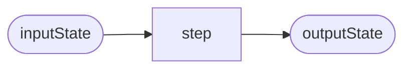

# Corvus.Pipelines

## What is it?

A low-allocation, extensible pipeline composition library, supporting sync and async functional pipeline steps arranged into terminating and non-terminating pipelines.

Out-of-the-box, it includes support for exception and error handling, logging, and cancellation.

Amongst other features, it supports (but does not require) ["railway oriented programming"](https://fsharpforfunandprofit.com/rop/) - avoiding exception throwing, and offering a functional approach to termination, error handling, and retries.

If you're familiar with these terms and know that's what you want, you can [review the ubiquitous language](./docs/ubiquitous-language.md) (so we can avoid miscommunication when using overloaded terminology), and  [skip ahead to the getting started section](#getting-started).

If you'd like to understand more about the thinking behind **Corvus.Pipelines** then read on.

## What can I do with it?

The library helps you to build programs dynamically (i.e. at runtime) out of predefined (functional) components, to operate on some particular state, and produce some result.

Those functional components are themselves stateless, and so can be reused without dynamic (re-)compilation/allocations etc.

It is useful when you want to be able to be able declaratively define the way in which a system responds to input, while dynamically adapating the processing to both the input state, and/or other environmental conditions.

It also supports moving (relatively) seamlessly from synchronous to asynchronous contexts, with minimal overhead, making it ideal for request processing and data scenarios where we frequently mix async processing (e.g. calling external services to augment our state) with synchronous processing (operating on our in-memory domain model).

It is particularly useful when you have a need for executing many, isolated pipelines that respond somewhat differently to different types of request, but share a lot of common processing.

## What kind of applications would find that useful?

It can be used in many applications, e.g. input handling, request processing, or data transformation.

Here are a few examples.

### ASP.NET Core
**Corvus.Pipelines** is particularly useful when coupled with, for example, [ASP.NET Core Minimal APIs](https://learn.microsoft.com/en-us/aspnet/core/fundamentals/minimal-apis/overview), or (especially) directly through `HttpContext`, to build lightweight pipelines for request processing from common building blocks.

We are using Corvus.Pipelines in code-generation scenarios for HTTP API handlers, where it is simpler to emit the code that builds pipelines than all of the code that they embody.

We also provide an `HttpContextPipeline` in `Corvus.Pipelines.AspNetCore` that directly supports `HttpContext` request processing.

### Corvus.YarpPipelines

We originally built this to help us reduce the complexity of building high-performance HTTP Request transforms in YARP proxies. We have also open-sourced our **Corvus.YarpPipelines** library which we have built on top of it.

### Corvus.Pipelines.Handlers

We use **Corvus.Pipelines** to implement a version of the [Chain of Responsibility](https://en.wikipedia.org/wiki/Chain-of-responsibility_pattern) pattern that doesn't couple each step directly to the next. We call this the Handler Pattern, and it is implemented by the types in the `Corvus.Pipelines.Handlers` namespace.

This is so useful, we include it in the **Corvus.Pipelines** library itself.

## Corvus.Pipelines vs. LINQ to objects vs. TPL Dataflow

### Q: But can't I do everything this does, and more, with assorted `Func<,>` and LINQ to objects?

### A: Yes; you can. But...

The idea of **Corvus.Pipelines** is to _constrain_ what you can do to make the programming model simpler, and enable some common patterns like retries, cancellation, logging and `Exception`-free error handling.

At the end of the day, it is just built on top of dotnet delegates/`Func<,>`, and you can bring in as much LINQ to objects as you like, around that! There's no special magic going on.

The workload that inspired the creation of this library started out just using LINQ-to-objects, but we rapidly discovered that we were having to write a lot of boiler plate around the code we really needed; and so this project was born.

### Q: What about TPL Dataflow - that has similar concepts in its blocks and networks, but gives us more control of parallelization and async behaviour.

### A: Yes, that's absolutely true.

[TPL Dataflow](https://learn.microsoft.com/en-us/dotnet/standard/parallel-programming/dataflow-task-parallel-library) is a very powerful library with a similar philosophy of in-process state-passing for dataflow and pipelining tasks.

It gives you much more control over the async context than we offer in **Corvus.Pipelines**.

However, it is much more heavy-weight; it doesn't attempt to minimize allocations, or optimize for (largely) synchronous use cases.

There's also a lot more ceremony in building and connecting blocks and pipelines; there's nothing wrong with that, but **Corvus.Pipelines** tries to put as little between the functional building blocks and the execution as possible.

This is what ensures, as with LINQ-to-objects, that TPL Dataflow (and [Parallel LINQ](https://learn.microsoft.com/en-us/dotnet/standard/parallel-programming/introduction-to-plinq)) can be seamlessly integrated into a **Corvus.Pipelines** pipeline (or vice-versa).

### Q: So _should_ I use this for coarse-grained, highly-parallel data processing pipelines?

### A: Probably not, no...

This is not intended for coarse-grained, highly parallizable data processing, where you are trying to execute large, in-memory workloads that consume all the resources on multi-processor machines.

Instead, it is geared towards executing many pipelines:

- with execution request affinity
- heterogenous behaviour
- composed largely of common step types
- on shared resources
- with low overhead (allocations, developer ceremony, additional compute cost)

Our experience suggests that in applications with these characteristics, the workloads are likely to be largely synchronous in nature, but with some asynchronous (rather than parallelizable) steps that, in a traditional programming model, require the entire call tree to be aware of the async pattern.

In those async cases, the pipeline is essentially suspended until they complete, such as when you perform network I/O operations.

This makes **Corvus.Pipelines** particularly applicable to, for example, HttpRequest handlers.

## How does it perform?

We have a suite of benchmarks that verify we have a low-overhead, low-allocation solution.

These are typical results for a YARP HTTP transform processing pipeline. It uses async steps, with and without logging.

| Method                 | Mean     | Error     | StdDev    | Ratio | Allocated | Alloc Ratio |
|----------------------- |---------:|----------:|----------:|------:|----------:|------------:|
| RunPipeline            | 6.317 μs | 0.0452 μs | 0.0377 μs |  1.00 |         - |          NA |
| RunPipelineWithLogging | 6.960 μs | 0.0395 μs | 0.0308 μs |  1.10 |         - |          NA |


Here's another example that compares the railway-oriented approach for error handling, with an exception-based process:

| Method                   | Mean         | Error       | StdDev      | Ratio  | RatioSD | Gen0   | Allocated | Alloc Ratio |
|------------------------- |-------------:|------------:|------------:|-------:|--------:|-------:|----------:|------------:|
| RunPipelineWithError     |     253.7 ns |     2.02 ns |     1.58 ns |   1.00 |    0.00 |      - |         - |          NA |
| RunPipelineWithException | 135,239.0 ns | 1,443.82 ns | 1,279.91 ns | 534.02 |    6.00 | 2.6855 |   11960 B |          NA |

# Concepts

A lot of the language used in this project is heavily overloaded with meaning in other domains, so it is useful to familiarize ourselves with some common terms, and what we take them to mean in this domain.

There is a separate document in this repository called [ubiquitous-language.md](./docs/ubiquitous-language.md) which includes these definitions in alphabetized form for easy reference.

We will introduce them as we come across them in the [getting started](#getting-started) section, but it is useful to have a quick reference to hand.

# Getting started

## What are steps?

A [step](./docs/ubiquitous-language.md#step) is a simple function that takes a value and returns another value of the same type. We call this value the [state](./docs/ubiquitous-language.md#state).

Let's illustrate that with a diagram. We will use diagrams like this throughout to explore various features of the library.



Rounded rectangles will represent [states](./docs/ubiquitous-language.md#state). Regular rectangles will represent [steps](./docs/ubiquitous-language.md#step). Arrows represent input and output from a function (in this case, the step which is, as you recall, a function).

Here's an example of a step in code.

```csharp
SyncPipelineStep<int> addOne = static state => state + 1;
```

If we execute the step with some given initial state (in this case the integer `1`), the resulting state is, as you might expect, `2`.

```csharp
// (1 + 1) = 2
int result = addOne(1);
```

> The code used in this document can be found in executable form in the [./Solutions/ReadMe/](./Solutions/ReadMe/) project.

## Composing steps into a pipeline
We can compose one or more of these steps into a [pipeline](./docs/ubiquitous-language.md#pipeline).

In a pipeline, each step operates on the output of the previous step, to produce the final result.


Here is a very simple pipeline whose state is an `int`.

```csharp
SyncPipelineStep<int> syncPipeline = Pipeline.Build<int>(
    static state => state + 1,
    static state => state * 2,
    static state => state - 1);

// ((1 + 1) * 2) - 1 = 3
int output = syncPipeline(1);
```

You can see that a pipeline is, itself, just another step.

We are using a function called `Build()` to create the pipeline step. This kind of function is called an [operator](./docs/ubiquitous-language.md#operator). We'll discuss operators in more detail later.

When we want to draw a diagram of a step which is composed of other steps, we will usually represent it inside a box, like this.


Sometimes we show the input or result states inside the composed-step box, sometimes outside the box (like this), and sometimes both - it depends on what we are trying to illustrate.

## Sync and Async steps

Although the individual steps passed to the `Build()` operator were all synchronous - but you can use async steps too.

In fact, async steps are the "natural" form in **Corvus.Pipelines**.

But rather than returning a `Task<TState>` we use `ValueTask<TState>`, so you avoid unnecessary overhead when operating in a purely synchronous context.

Here's an example of an async step. It makes use of `Task.Delay()`.

```csharp
PipelineStep<int> asyncPipeline = Pipeline.Build<int>(
    static async state =>
    {
        await Task.Delay(1000).ConfigureAwait(false);
        return state * 2;
    });
```

If you want to mix sync and async steps in a single pipeline, you need to coerce your synchronous steps into the async form. One way to do this is to wrap your synchronous results using `ValueTask.FromResult()`. This offers a very low-overhead adapter from sync-to-async.

```csharp
PipelineStep<int> pipeline = Pipeline.Build<int>(
    static state => ValueTask.FromResult(state + 1),
    static async state => { await Task.Delay(0); return state * 2; },
    static state => ValueTask.FromResult(state - 1));
```

> Alternatively, you can use the `ToAsync()` operator on the step itself. We'll see an example of that in a moment.

## Termination

Pipelines can be [terminating](./docs/ubiquitous-language.md#terminating-pipeline), or [non-terminating](./docs/ubiquitous-language.md#non-terminating-pipeline).

We have already seen examples of non-terminating pipelines (they just run each step in turn, from the first to the last).

A terminating pipeline takes a _predicate_ to determine if it should terminate, along with the usual array of steps.

A predicate is a function that takes a value (in this case the current state), and returns `true` or `false`. We will use the lozenge symbol to indicate a predicate in our diagrams, and dotted lines for the possible results.


> In fact, we will use a lozenge for any decision/choice function, not just a boolean predicate.

A terminating pipeline operates in essentially the same way as a non-terminating pipeline, passing the output of each step as the input to the next one. However, after each step, it executes the predicate to determine if it should stop. If so, it terminates and returns the state at that point - executing no further steps.


> Note that it tests the predicate *before* executing the first step, and terminates if the state already meets the condition, and it *does not* test the predicate after the last step - it just runs to completion.

Let's look at an example of that in code.

First, let's pull out a common step we can reuse.

```csharp
static class CommonSteps
{
    public static SyncPipelineStep<int> MultiplyBy5 =
        state => state * 5;
}
```

> One of the powerful features of **Corvus.Pipelines** is that you can build up a library of steps in your application.
>
> Static instances can be reused and help keep allocations low, and performance high. They also ensure you are not silently capturing extra state at runtime - you'll get a compiler error if you try.

Then, we use the `Build()` operator overload that takes a _termination predicate_.

```csharp
PipelineStep<int> terminatingPipeline = Pipeline.Build(
    shouldTerminate: state => state > 25,
    CommonSteps.MultiplyBy5,
    CommonSteps.MultiplyBy5
);
```

In this case we are telling the pipeline to terminate if the state is `>25`.

If we run the pipeline with `1` as the input, we get

- `1` is not `>25`, so it goes on to execute the first step.
- `(1 * 5) = 5` is produced by the first step.
- `5` is not `>25`, so the pipeline continues and
- `(5 * 5) = 25` is produced by the second step.
- `25` is not `>25` so this is passed on and becomes the final output.

```csharp
// (1 * 5) * 5 = 25
int output = await terminatingPipeline(1).ConfigureAwait(false);
```

However, if we pass `6` as the input to the pipeline, we get

- `6` is not `>25` so it goes on to execute the first step.
- `(6 * 5) = 30` is produced and
- `30` _is_ `>25` so the pipeline will terminate and return the result. `30`. The second step is not executed.

```csharp
// (6 * 5) [Terminate] = 30
int output = await terminatingPipeline(6).ConfigureAwait(false);
```

## Branching

Often, you want to choose a different branch down the pipeline based on the current state.


> I've not illustrated the state in this daigram; you can assume it flows in and out of the steps in the usual way, along the arrows.

This diagram illustrates a case where we execute `step1`  and `step2`, then, based on the state at that point (and maybe other things available to us in our execution environment), we choose to execute either `path1`, `path2`, or `path3`, the result of which is fed into step 3.

We provide a `Choose()` operator for exactly these circumstances.

Before we look at how `Choose()` works, let's see how we use it.

Here are some steps that we can imagine work on values in some invoicing application.

```csharp
static class InvoiceSteps
{
    public static SyncPipelineStep<decimal> ApplyLowDiscount =
        state => Math.Ceiling(state * 100 * 0.8m) / 100;
    public static SyncPipelineStep<decimal> ApplyHighDiscount =
        state => Math.Ceiling(state * 100 * 0.7m) / 100;
    public static SyncPipelineStep<decimal> ApplySalesTax =
        state => Math.Ceiling(state * 100 * 1.2m) / 100;
}
```

We have two discount policy steps, one for a low invoice total, and one for a high invoice total; plus a step that applies sales tax.

And here's a pipeline step that uses those steps to process an invoice total and apply a discount:

```csharp
SyncPipelineStep<decimal> chooseDiscount =
    Pipeline.Choose(
            selector: static (decimal state) =>
            state switch
            {
                > 1000m => InvoiceSteps.ApplyHighDiscount,
                > 500m => InvoiceSteps.ApplyLowDiscount,
                _ => Pipeline.CurrentSync<decimal>(),
            });
);
```

This pipeline selects a discount step based on the current value.

The discount selection is performed by function provided to the `Choose()` operator, which takes the input state and returns a suitable step.

In this case the function looks at the state, and returns the `ApplyHighDiscount` step if the state is `>1000`, and the `ApplyLowDiscount` step if the state is `>500`,m
and no discount at all if the step is `<=500`.

We can now combine that step with our sales tax application:

```csharp
SyncPipelineStep<decimal> invoicePipeline =
    Pipeline.Build(
        chooseDiscount,
        InvoiceSteps.ApplySalesTax);
```

So, let's see what happens if we run our pipeline with the value `1000`

```csharp
// 1000m => Choose[<=1000m] =>
//     ApplyLowDiscount () => (1000 * 0.8) = 800 =>
// ApplySalesTax => (800 * 1.2) = 960
decimal output = await invoicePipeline(1000m).ConfigureAwait(false);
```

The step produced by `Choose()` selects and executes the low discount step because `1000` is `>500`, but `<=1000`. It executes that step with the current state, to produce `800`.

Once it has completed that, we are back on the main flow of the pipeline, and it continues with the next step which is `ApplySalesTax`.

This takes that value and produces `(800 * 1.2) = 960`.

So the overall pipeline has applied the 20% discount, before applying the sales tax.

If on the other hand, we pass `2000` as the input state, we take a different path.

```csharp
// 2000m => Choose[>1000m] =>
//     ApplyHighDiscount () => (2000 * 0.7) = 1400 =>
// ApplySalesTax => (1400 * 1.2) = 1680
decimal output = await invoicePipeline(2000m).ConfigureAwait(false);
```

The step produced by `Choose()` selects and executes the *high* discount step because `2000` is `>1000`. It executes that step with the current state, to produce `1400`.

Once it has completed that, we are back on the main flow of the pipeline, and it continues with the next step which is `ApplySalesTax`.

This takes that value and produces `(1400 * 1.2) = 1680`.

So the overall pipeline has applied the 30% discount instead of the 20% discount, before applying the sales tax.

Notice that in this case we used a simple either-or choice - but you could write arbitrarily complex logic to choose between steps to emit - or even build a custom pipeline on-the-fly.

Equally, the chosen step could be an arbitrarily complex pipeline. For example, it could look at anything else it had access to from the state it was passed to determine the discount level. We will look at more complex state later.

So `Choose()` is a function that has allowed us to make a decision about which step to execute next, based on the output from the previous step.

Like `Build()` it has composed multiple steps together, to produce a single step that exhibits more complex behaviour.

We call this kind of a function an [operator](./docs/ubiquitous-language.md#operator).

## Applying operators

We'll start with a definition, introduce some new notation for our digrams, then move on to an example.

### Definition

**An operator is a function that takes a step** (along with other parameters that are available at pipeline-build time, including other steps) **and returns a step.**

> For the mathematically minded, this somewhat akin to the mathematical definition of an operator as a function that maps from one function space to another.

Unlike steps, which execute when the pipeline is _run_, operators execute when the pipeline is _built_, in order to create new steps.

### Notation

We are going to introduce a symbol to represent operators in our diagrams. Operators are functions, so we will stick with the rectangular shape, but they are functions that produce functions, so we will use a double rectangle.


### Bind: a simple but powerful operator
Now that we have a new symbol to use, let's explore a real operator in more detail.

We'll look at `Choose()` again in a moment, but first let's look at one of the simplest operators:  `Bind()`.

There are several versions of `Bind()` available in the library, but the simplest one takes two steps and produces a step that _binds_ them together.

The step it creates
- executes the first step with its input
- executes the second step with the output of the first step
- returns the output of the second step as its result

Let's look at a diagram which illustrates how the bind operator takes the two steps and produces a step which combines them in that way.


You can then use the new compound step in the usual way.


> Remember: the operator *does not* execute any steps; it builds a step that executes steps (and other logic).

Here's an example using our invoicing steps.

```csharp
public static SyncPipelineStep<decimal> ApplyHighDiscountAndSalesTax = ApplyHighDiscount.Bind(ApplySalesTax);
```

We can now execute this step and it is the equivalent of executing each of the previous steps in turn.

```csharp
// (1000 * 0.7) * 1.2 = 840
var result = InvoiceSteps.ApplyHighDiscountAndSalesTax(1000);
```

Notice that `Bind()` *does not* execute the step there and then. It produces a step which _can be_ executed as part of a pipeline. That is the essential distinction between an operator, and a step.

Although it is seemingly simple, this ability to compose steps using `Bind()` underpins the whole concept of a pipeline.

Remember our `Pipeline.Build()` operator? You can think of that being built on `Bind()`.

It is equivalent to calling:

```csharp
steps[0].Bind(steps[1]).Bind(steps[2]) /*...*/ .Bind(steps[n])
```

> In practice, it is implemented differently for optimization purposes. But conceptually, it is built on this `Bind()` operator.

Most of the rest of this document will look at using other operators to compose more sophisticated pipelines.

### Revisiting Choose()

Now that we know how operators work, we can take another look at `Choose()`.

`Choose()` is an operator that produces a step that conditionally executes some other step chosen by executing its selector function.


Internally, its implementation is conceptually like this:

```csharp
public static PipelineStep<TState> Choose<TState>(this PipelineStep<TState> step, Func<TState, PipelineStep<TState>> selector)
    where TState : struct
{
    return step.Bind(state => selector(state)(state));
}
```

It binds the input `step` to a step which calls the `selector` with the `state`, then calls the step produced by the selector with that state, returning the result.

> In fact, this is exactly how it is implemented at the time of writing.

## The current state

What if you want to use an operator, such as `Choose()` but you don't have an existing step to which to apply it?

We've already seen an example of this in our invoice processing code. Let's remind ourselves of that:

```csharp
SyncPipelineStep<decimal> chooseDiscount =
    Pipeline.Choose(
            selector: static (decimal state) =>
            state switch
            {
                > 1000m => InvoiceSteps.ApplyHighDiscount,
                > 500m => InvoiceSteps.ApplyLowDiscount,
                _ => Pipeline.CurrentSync<decimal>(),
            });
);
```

Here, the `Choose()` operator is not being applied to any particular step - we're using the static method on the `Pipeline` type.

However, we could have used the version of the operator that applies to a specific step.

```csharp
SyncPipelineStep<decimal> chooseDiscount =
    Pipeline.CurrentSync<decimal>().Choose(
            selector: static (decimal state) =>
            state switch
            {
                > 1000m => InvoiceSteps.ApplyHighDiscount,
                > 500m => InvoiceSteps.ApplyLowDiscount,
                _ => Pipeline.CurrentSync<decimal>(),
            });
);
```

Notice that the `Choose()` operator is applied to the output from another special operator called `Pipeline.CurrentSync<decimal>()`.

> There is an async version too - `Pipeline.Current<T>()`

This operator provides a step which, when executed, just returns the current state of the pipeline.

This, in fact, gives you the "something" on which an operator can operate, if you do not otherwise have some specific step. This effectively threads the current state through the pipeline when it is executed.

> As you have seen, for common operators like `Choose()` we provide a custom implementation that guarantees to optimize-away the step created by `Current()`. But this is very useful when building your own pipelines. You can think of those step-less operators as operating on `Pipeline.Current()`.`

## Pipelines and Handlers

Most people are familiar with the [Chain of Responsibility](https://en.wikipedia.org/wiki/Chain-of-responsibility_pattern) pattern, in which some state is passed from one potential handler to the next until someone decides that they can handle it and produces a result, rather than calling the next handler in the chain.

We implement a version of this in the `Corvus.Pipelines.Handlers` namespace, in which the `TState` of our `PipelineStep` is an instance of a `HandlerState<TInput, TOutput>`, and pipelines of this type are built using the `HandlerPipeline.Build()` methods.

As with all pipelines, the input state is passed to each handler step in turn.

When a step does not handle the result it returns

```csharp
(TInput state) => state.NotHandled()
```

When it does it returns

```csharp
(TInput state) => state.Handled(returnValue);
```

The pipeline itself terminates with the first step that returns a `Handled()` result.


The client calls the step with a suitable input value:

```csharp
var result = pipeline(HandlerState<string, decimal>.For(someInputValue))
```

and then determines whether the input was handled and retrieves the result:

```csharp
if (result.WasHandled(out TOutput output))
{
    // work with the output
}
```

Let's look at an example of that.

Imagine we had a couple of pricing catalogs that take a product ID and return us the price of that product. We can wrap access to those catalogs in a step.

> In this example we are just using sync steps and a switch statement. In real life these would likely be async steps and call out to a catalog API of some kind.

Notice that the steps return `state.Handled()` with the output price for any product ID they recognize, and `state.NotHandled()` for the catalog ids they don't recognize.

```csharp
static class PricingCatalogs
{
    public static SyncPipelineStep<HandlerState<string, decimal>>
        PricingCatalog1 =
            state =>
            {
                return state.Input switch
                {
                    "Catalog1_Product1" => state.Handled(99.99m),
                    "Catalog1_Product2" => state.Handled(20.99m),
                    _ => state.NotHandled(),
                };
            };

    public static SyncPipelineStep<HandlerState<string, decimal>>
        PricingCatalog2 =
            state =>
            {
                return state.Input switch
                {
                    "Catalog2_Product1" => state.Handled(1.99m),
                    "Catalog2_Product2" => state.Handled(3.99m),
                    _ => state.NotHandled(),
                };
            };

    public static SyncPipelineStep<HandlerState<string, decimal>>
        PricingCatalog3 =
            state =>
            {
                return state.Input switch
                {
                    "Catalog3_ProductA" => state.Handled(12.99m),
                    "Catalog3_ProductB" => state.Handled(21.99m),
                    _ => state.NotHandled(),
                };
            };
}
```

We can then build a `HandlerPipeline` step that will pass the product ID to each handler step in turn, trying to find one that can handle it.

```csharp
static class PricingCatalogs
{
    // ... the catalog steps ...

    public static SyncPipelineStep<HandlerState<string, decimal>>
        PricingHandler =
            HandlerPipeline.Build(
                PricingCatalog1,
                PricingCatalog2,
                PricingCatalog3);
}
```

We can then use the pipeline to produce a price for a catalog item:

```csharp
string productId = "Catalog2_Product2";

HandlerState<string, decimal> pricingResult =
    PricingCatalogs.PricingHandler(
        HandlerState<string, decimal>.For(productId));

Console.Write(productId);
Console.Write(" ");

if (pricingResult.WasHandled(out decimal price))
{
    Console.WriteLine(price);
}
else
{
    Console.WriteLine("was not priced");
}
```

This passes the product ID to the first product catalog step, which returns `State.NotHandled()` as it cannot match the ID.

The pipeline checks the result and doesn't terminate, so it passes the product ID to the second catalog step, which recognizes the ID and returns `state.Handled(3.99m)`.

The pipeline recognizes the "handled" result, and terminates, returning the value provided by the second catalog step. It does not pass it on to the third step.

## More ways to Bind()

Sometimes you will have reusable steps that operate on different types that are (sometimes) convertible, but not directly compatible.

e.g. a `PipelineStep<int>` and a `PipelineStep<decimal>`.

Or maybe you have steps that operate on some information that can be derived from your existing state, or can be augmented with information from elsewhere in your execution environment (such as by calling another API with parameters provided from your state).

For example, imagine we had a `Name` type:

```csharp
public readonly record struct Name(NonNullableString FirstName, NonNullableString LastName);
```

We might have a `PipelineStep<Name>` that processes names, and a `PipelineStep<NonNullableString>` capable of processing a part of a name.

> `NonNullableString` is, as the name implies, a non-nullable representation of a `string` as an value type. It has the same equality and hashing semantics as a regular `string` but you can use it directly in a pipeline.

Or maybe the step needs its input state to support different _capabilities_ such as error reporting or cancellation, that your state doesn't.

> We will learn more about [capabilities](./docs/ubiquitous-language.md#capability) later.

In any of these cases, we will need to be able to convert an instance of our existing step's `TState` to an instance of some `TInnerState` as used by the step to which we wish to bind.

There are overloads of `Bind()` that do exactly that.

These overloads of take two mapping functions: `wrap()` and `unwrap()`, and produce a step like this:


> We've used a dashed rectangle to indicate a function that is neither a step, nor a predictate/conditional.

The first function (`wrap`) takes the value return by `step1` (an instance of `TState`), and returns an instance of the type required by `step2` (`TInnerState`).

```csharp
Func<TState, TInnerState> wrap
```

The second function (`unwrap`) takes the _both_ the value returned by `step1` (an instance of `TState`), _and_ the value returned by `step2` (an instance of `TInnerState`), and maps it to an instance of `TState` to be returned as part of the original pipeline.

```csharp
Func<TState, TInnerState, TState> unwrap
```

So, when the step produced by the `Bind()` operator is executed, it:

- Executes the initial step
- Calls `wrap()`, passing it the result of the initial step.
- It then executes the bound step with the result from `wrap()`.
- The result of that is passed to the `unwrap()` function.
- The result of that is returned from the step.

### Example: binding to a handler pipeline

A common use for this type of binding is when you are connnecting a handler pipeline into an overall pipeline.

> TODO: We're here!

### When to use Bind()?

Bind (with or without wrapping and unwrapping) is a very powerful technique, and you can get a long way using it without writing a completely "custom" operator (or a lot of steps).

But don't be afraid of writing a completely custom bind-like operator.

Remember, `Bind()` is conceptually as simple as...

```csharp
return state =>
{
    var result = Wrap(state);
    var stepResult = step(result.somethingSuitable);
    return Unwrap(stepResult);
}
```

If you have semantics which are better expressed by writing your own custom operator like this, then do so.

Don't turn your code inside out to fit the _wrap, bind, unwrap_ model. Instead, try to create "semantically complete" packages of code - functions that express a well-bounded unit of value.