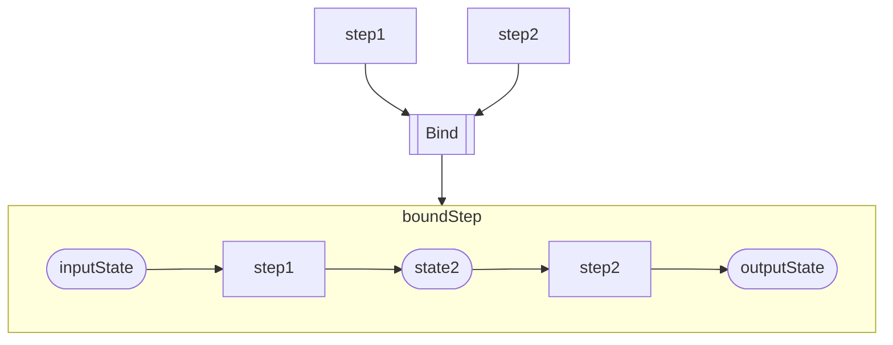
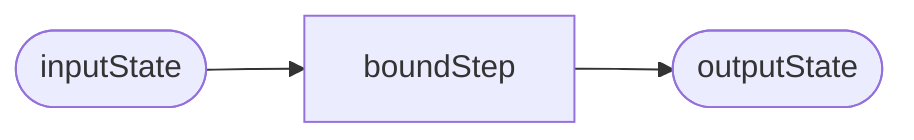
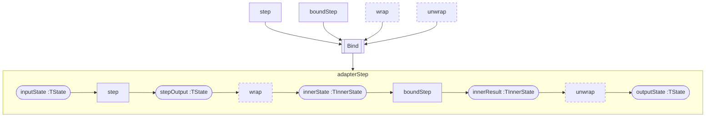

# Ubiquitous Language

A lot of the language used in this project is heavily overloaded with meaning in other domains, so it is useful to familiarize ourselves with some common terms, and what we take them to mean in this domain.

## Binding

One [step](#step) is _bound_ to another when we produce a step that executes the first step, and passes its output as the input to the second step, and returns the result of the second step.


You can then use the new compound step in the usual way.




We can also convert between steps of different states `TState`, and `TInnerState` by wrapping and unwrapping the values during binding.



## Capability

A _capability_ is a well-known pattern or semantic model implemented by some [state](#state), which an [operator](#operator) can rely on in its implementation.

In **Corvus.Pipelines**, capabilities are defined by interfaces implemented by state types.

Commonly implemented capabilities include `ILoggable`, `ICancellable`, and `ICanFail`..

## Non-terminating pipeline

A _non-terminating pipeline_ is a [pipeline](#pipeline) that executes each step in turn, returning the result of the final step as its result. Contrast this with a [terminating pipeline](#terminating-pipeline)

## Operator

An operator is a _function_ that takes a [step](#step) (and potentially other parameters, including other steps), and returns a [step](#step).

Operators are used when building a pipeline to compose or transform other steps, without needing to know how those other steps actually work. For example, the [Bind](#binding) operator composes two steps, passing the output of one as the input of another, without needing to know what those steps actually do.

> For the mathematically minded, this somewhat akin to the mathematical definition of an operator as a function that maps from one function space to another.

## Pipeline

A pipeline is a [step](#step) that executes an ordered series of [steps](#step), feeding its input [state](#state) to the first step, and the output of the first step as the input to the second step, and so on, until the output of the final step produces its result.

Pipelines may be [_terminating_](#terminating-pipeline) or [_non-terminating_]('non-terminating-pipeline).

## Predicate

A function that takes [state](#state) and returns `true` or `false`.

## State

_State_ is a value of a particular type `TState` that is passed into a [step](#step). The result of the step is a new instance of that type `TState`.

State has value semantics, and is generally immutable (although the processing performed by a step may have side-effects).

## Step

A step is a _function_ that takes some [state](#state), processes it, and returns a new [state](#state).

While this pattern allows [state](#state) to be immutable, we do not disallow side-effects, and, in fact, side-effects are very commonly the desired result of processing.

> For example, we might have a step that updates an HTTP response based on processing the request. The request and response documents form part of the state. While the state itself is immutable, the response document is not.

Steps can be arranged into [pipelines](#pipeline).

In **Corvus.Pipelines**, a step can be either synchronous or asynchronous. An asynchronous step is of the form

```csharp
public delegate ValueTask<TState> PipelineStep<TState>(TState state)
```

whereas a synchronous step is of the form

```csharp
public delegate TState SyncPipelineStep<TState>(TState state)
```

The async form is considered to be the "primitive" form.

Any synchronous step can _always_ be converted to an asynchronous step by using the `ToAsync()` [operator](#operator). The reverse is not true.

Alternatively, you can make your otherwise-synchronous implementation function async by wrapping your return value with `ValueTask.FromResult()`.

This is a common operation to when composing mixed sets of sync and async steps.

Most [operators](#operator) offer both sync and async overloads so you can avoid having to think too hard about this in real code.

## Terminating pipeline

A _terminating pipeline_ is a [pipeline](#pipeline) with an associated [predicate](#predicate) that is called with current state before each step is executed. If the predicate returns `true` then the pipeline is terminated immediately, returning the current value of the state. If `false` it proceeds with the next step.

Note that terminating early does not necessarily imply an _error_.
